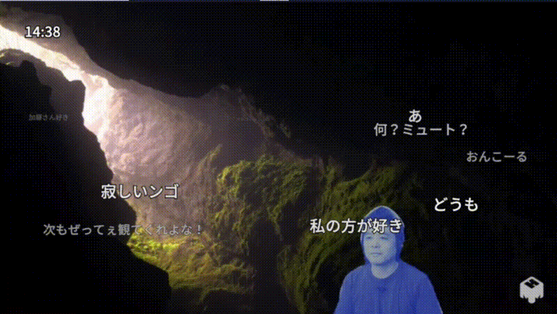
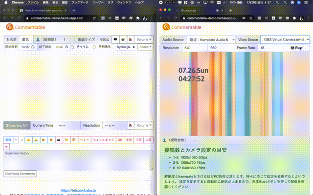

|  | 
|:--:|
|mmhmmのVritual カメラにコメントを載せたところ|


|  | 
|:--:|
| broadcast機能を使って、お手軽配信しているところ。左がviewerページ、右が配信ページ  |

# Commentableとは
授業中に気軽に学生にコメントしてほしい。このシンプルな欲求から開発をスタートしました。
[commentscreen](https://commentscreen.com/ )が素晴らしく、たくさんインスパイアされました。ただ、、
  * OSBと連携したい（OBSのVirtual Cameraにコメントを載せたい）
  * mmhmmにコメント載せたい
  * 音声読み上げや、リアクション、授業に特化したコメント機能を手軽に追加（プロトタイピング）したい
  * ブラウザだけで動作して、なんならzoomとかなくても最悪配信できちゃいたい

といったcommentscreenでは簡単に実現できない個人的な希望を叶えるために、2020年のオンライン授業のために開発しました。東京都立大学のプロトタイピング基礎及びインタラクションデザイン演習実習Ⅰという授業にて、実際に本ソフトウェアを授業の過程で試作していき、前期授業終了に合わせ、最終的にここに公開することとしました。

I want students to feel free to comment during my class. So I started developing it with this simple desire.
The [commentscreen](https://commentscreen.com/ ) was great and inspired me a lot except for the following points.
  * I want to work with OSB (I want to put my comments on OBS's Virtual Camera)
  * I want to post a comment on mmhmm.
  * I want to easily add text-to-speech, reaction, and class-specific commenting features (prototyping).
  * I'd like to be able to run in the browser alone, and if I don't have a zoom or something, I want distribute video/audio just on this system.

I developed this software for an online class in 2020 in order to fulfill a personal wish that cannot be easily achieved with commentscreen. I will make a prototype of this software in a course called "Basic Prototyping and Interaction Design Practice I" at Tokyo Metropolitan University, and will finally release it here at the end of the first semester.


# 動作環境
  * macOS, Windows, Linux上にて、ChromeまたはFirefoxにて動作。SafariやIEは非推奨
  * Works on macOS, Windows, and Linux with Chrome or Firefox, Safari and IE are not recommended.

# Demo
以下はデモとして公開しているリンクですので、実際に利用する場合にはnode.jsが利用可能なサーバにデプロイしてご利用ください。以下ではherokuにデプロイしています。

The following links are provided as a demo, so please deploy to a node.js-enabled server before using it in practice. In the following, we've deployed to heroku.

## 単独での利用方法
下記リンクをそれぞれ ChromeまたはFirefoxで開いて、配信ページのスタートボタンを押すと、受信、コメントページに配信画像が表示されます。コメントした内容が同じ受信、コメントページを開いている他のユーザにも同時に閲覧できるようになります。ブラウザのみで全て完結しているので、非常に便利ですが、接続者数が20名を超えるような配信を行う場合は、次に示す他の配信アプリケーション（ZoomやMicrosoft Teams等）との併用にてご利用ください。WebRTCによるP2P接続にて各ユーザに映像を配信するため、どうしても配信側のPC負荷に限界があります。またP2P通信のため、利用するネットワーク環境によっては映像及び音声が受信できない場合があります。
  * 配信ページ：https://commentable-demo.herokuapp.com/broadcast.html
  * 受信、コメントページ：https://commentable-demo.herokuapp.com/

  Open the following links in Chrome or Firefox, respectively, and press the start button on the delivery page to display the delivery image on the receive and comment pages. Your comment will be visible to other users who are on the same receiving and commenting pages at the same time. However, if you want to distribute to more than 20 users, please use it in combination with other distribution applications (such as Zoom and Microsoft Teams) as shown below. Therefore, there is a limit to the PC load on the transmission side. In addition, because of P2P communication, video and audio may not be received depending on the network environment.
  
  * Broadcasting page：https://commentable-demo.herokuapp.com/broadcast.html
  * viewe and comment page：https://commentable-demo.herokuapp.com/


## 他の配信ツールとの併用
下記の受信、コメントページを開き、画面共有ボタンを押し、ブラウザ窓または、表示箇所を個別に配信に利用してください。配信者は受信、自身の画面キャプチャやカメラ画像の上にコメントが表示されるので、その内容をZoomやhangoutなどを利用して共有してください。
  * 受信、コメントページ：https://commentable-demo.herokuapp.com/

Go to the receive and comment page below, click on the share screen button, and use the browser window or the display area individually for distribution. The sender will see the comments on top of their screen capture or camera image, and they can share the comments using Zoom or hangout.
* viewe and comment page：https://commentable-demo.herokuapp.com/


# Installation
local環境での実行手順を示します。デプロイするときはデプロイ先の指示に従ってください。

```
$ git clone https://github.com/TetsuakiBaba/commentable.git
$ cd commentable
$ npm install
$ node server.js
open http://localhost on Chrome/Firefox browser for viewer mode
open http://localhost/broadcast.html on Chrome/Firefox browser for broadcasting mode
```

# Technical Details
## broadcast.html について
WebRTCによるP2P接続を利用していますので、利用するネットワーク環境（特に組織内ローカルネット等）によってはいわゆるNAT超えができずに映像配信が行えない場合がありますので、ご注意ください。

Please note that depending on your network environment (especially the local network in your organization), it may not be possible to exceed the so-called NAT and video delivery may not be possible because of a P2P connection using WebRTC.

## Limitation
javascriptを利用したキャンバス上にコメントが表示されますが、これらをNDIやVritual Camera等を通じて直接他の配信ツールに映像を渡すことが現状では実装できていません。broadcast機能を利用して直接配信する分には問題はありませんが、多人数（殆どがこのケースでの利用かなと思います）の場合は他の配信ツールを利用してこのキャンバスをどうにかして配信することになると思います。Zoomの場合は画面の領域を直接キャプチャできる機能があるので、それをお使いください。

The comments are displayed on the javascript-based canvas, but it is not possible to pass the comments directly to other distribution tools through NDI or Vritual Camera. If you have a large number of people (mostly in this case, I think), I think you'll have to use other distribution tools to somehow distribute this canvas; Zoom has a feature that allows you to capture the screen area directly.


# Contribution
本プロジェクトをサポートしてくれる方、いらっしゃればご連絡いただけると幸いです。謝礼も検討できます。欲しい機能は次のとおりです。
  - js canvasイメージのNDI送信
  - リファクタリング
  - 自動翻訳機能の実装

If you would like to support this project, please contact me if you are interested in supporting this project. An honorarium can also be considered. Here's what we'd like to see
  - Sending an NDI of a js canvas image
  - refactoring
  - Implementation of automatic translation function

# Requirement
  - node.js: https://nodejs.org/en/
  - p5.js( revised by Tetsuaki Baba ): https://p5js.org
  - p5.sound.js: 
  - WebRTC: https://developer.mozilla.org/ja/docs/Web/API/WebRTC_API
  - speechSynthesis: https://developer.mozilla.org/ja/docs/Web/API/Window/speechSynthesis


# Author
  * Tetsuaki Baba
    * Tokyo Metropolitan University
    * https://tetsuakibaba.jp

# License
一部の音声ファイルを除き、Commentableは MIT ライセンスにて配布しています。