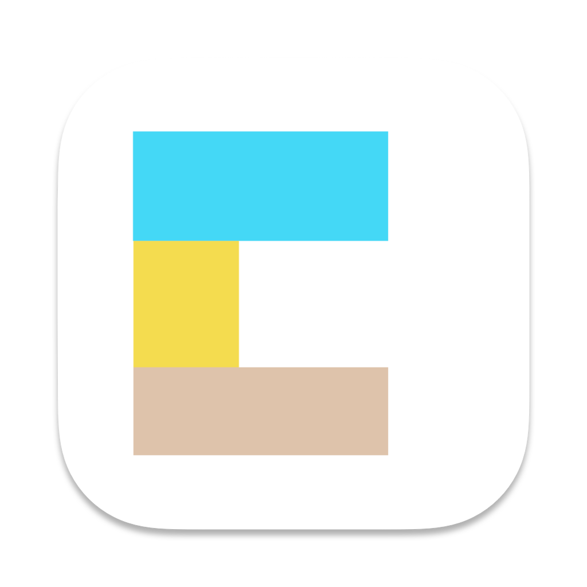

<p style="text-align:center">
  
</p>

# Getting Started
とにかくCommentableを利用するだけ，という方は以下のページを参照してください．
  * https://commentable.carrd.co/

# Compatibility
  * 配信者 commentable-desktop
    * [x] macOS
    * [x] Windows
    * [ ] Linux
  * 視聴者 webpage
    * Chrome
    * Firefox
    * Safari
    * Edge

# Installation

## Local Server
local環境での実行手順を示します。デプロイするときはデプロイ先の指示に従ってください。

```
$ git clone https://github.com/TetsuakiBaba/commentable.git
$ cd commentable
$ npm install
$ node server.js
open http://localhost on Chrome/Firefox browser for student mode
```

## Desktop Application
配信者はデスクトップアプリケーションである commentable-desktop を利用することで、コメントを自身のデスクトップ上に表示することができます。ビルドしたアプリケーションは以下からダウンロードできます。
  * https://github.com/TetsuakiBaba/commentable/releases


公式ページ (https://commentable.carrd.co/) には最新版のダウンロードリンクが貼られています。ビルド済みアプリケーションではcommentableのデプロイ先が固定されているため，自身のサーバ環境で実行する場合は、以下の手順でビルドを行ってください。

### Build
以下の手順で自身でビルドすることもできます。また別のサーバにデプロイしている場合は、electron/main.js の url を変更してください。ローカル環境でテストさせる場合はmain.js内の const USE_LOCAL_SERVER = true; を設定してください。

```
cd electron
npm install
npm exec --package=@electron-forge/cli -c "electron-forge import"
npm run make
```

intel chip macOS 用のビルドは以下のコマンドを実行してください。
```
npm run make -- --arch="x64"
```

## 不適切用語のフィルタリング
不適切用語のフィルタリングは、public/inappropriate-words-ja/ 以下にbase64化されて保存しています。元となっているリストは [https://github.com/MosasoM/inappropriate-words-ja](https://github.com/MosasoM/inappropriate-words-ja) を利用しています。

## 管理者ページ (ダッシュボード) のセットアップガイド
管理者ページ (ダッシュボード) のセットアップ方法について説明します。ダッシュボードはコメントの管理や設定変更を行うためのインターフェースです。 詳細なセットアップ手順は以下のリンクを参照してください。
[ダッシュボードのセットアップガイド](DASHBOARD_SETUP.md)

# Author
  * Tetsuaki Baba
    * Tokyo Metropolitan University
    * https://tetsuakibaba.jp

# License
一部の音声ファイルを除き、Commentableは MIT ライセンスにて配布しています。